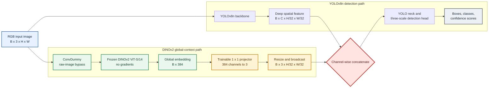

# YOLOv8n + DINOv2: Implementation Explanation for Presentation

## 1. Project Goal

The project tests whether a pretrained DINOv2 image representation can provide global scene context to a YOLOv8n object detector. YOLO is responsible for locating and classifying objects. DINOv2 contributes a learned representation of the whole image. The experiment compares ordinary pretrained/fine-tuned YOLOv8n with a YOLOv8n model whose deepest feature is fused with DINOv2 context.

This is a hypothesis, not a guaranteed improvement. The result must be based on the measured validation metrics.

## 2. Core Idea

YOLO builds spatial feature maps at several resolutions and predicts boxes at three scales. DINOv2 ViT-S/14 turns an RGB image into a 384-dimensional global class-token embedding. The implementation projects that vector into three channels and broadcasts those channels over YOLO's deepest spatial grid. YOLO then concatenates this context map with its deep feature map and sends the combined feature through the usual detection neck/head.

**How to read it:** the same RGB image enters both branches. YOLO preserves
spatial detail for localization; frozen DINOv2 summarizes the whole image.
The trainable projector turns that global summary into a small context map,
which is concatenated with YOLO's deepest spatial feature before detection.

At a 640 x 640 input, the stride-32 feature grid is 20 x 20, so the projected DINO context has shape `(batch, 3, 20, 20)`. At a 320 x 320 input it is `(batch, 3, 10, 10)`. The actual VOC experiment configures 640 x 640.

Important limitation: a global class token is broadcast uniformly over the spatial grid. It supplies image-level context but no location-specific DINO patch detail. Spatial patch-token fusion is a possible follow-up, not part of the current experiment.

## 3. What the Main Code Does

### `ConvDummy`

In [scripts/dino_modules.py](scripts/dino_modules.py), `ConvDummy` returns its tensor unchanged. It exists so the model graph can keep a route from the original RGB input to DINOv2 while the regular YOLO backbone processes the same image.

### `DINOv2`

The `DINOv2` module:

1. Loads the pretrained `dinov2_vits14` backbone through PyTorch Hub.
2. Keeps the backbone in evaluation mode and freezes its parameters.
3. Resizes and normalizes the RGB tensor using ImageNet mean/std.
4. Runs DINOv2 under `torch.no_grad()` to obtain the 384-value image embedding.
5. Uses a trainable 1 x 1 convolution to map 384 channels to 3 context channels.
6. Bilinearly resizes the projected context to the stride-32 YOLO grid.

Only the DINO encoder is frozen. The projector and YOLO detector are trainable. `register_modules()` exposes the custom module names to Ultralytics' YAML parser; that registration is needed whenever a model is constructed or a checkpoint is loaded in a fresh process.

### `configs/yolov8-dino.yaml`

This file describes the graph. Layer 0 is the raw-image bypass. The standard YOLOv8n backbone follows, ending at SPPF. The DINO branch takes the raw image from layer 0. The head concatenates DINO context with the SPPF feature and then continues through the YOLO feature pyramid and three-scale Detect head.

The config uses YOLOv8n scale settings. The DINO projection is intentionally compact at three channels; it is not a 1024-channel DINO feature map.

### Pretrained-weight transfer in `build_fused_model()`

Adding `ConvDummy` and `DINOv2` changes the layer indices compared with stock YOLOv8n. The notebook maps each compatible fused layer back to its original YOLOv8n layer and copies weights when tensor shapes match.

Two C2f input convolutions are wider by three channels because they receive the DINO context. For those convolutions, the code copies the original filters into their matching positions, inserts three small nonzero context filters at the correct concatenation offset, and retains the remaining pretrained filters. This preserves as much of the baseline detector as possible instead of randomly initializing the whole YOLO network.

The DINO encoder is explicitly frozen at training start. The notebook reports projector weight and bias norms at the end of each epoch so we can see whether the adapter changes during actual training.

## 4. Why the One-Batch Check Is Not a Smoke Training Run

Before spending time on full VOC training, the notebook performs a forward pass and one synthetic labeled detection-loss backward/optimizer step. It checks that:

- The DINO context and detector outputs have expected shapes.
- Outputs are finite (not NaN or infinity).
- The DINO projector receives a nonzero gradient from the detection loss.
- An optimizer step changes the projector weights.

This is a functional diagnostic only. It does not train on VOC images, produce assignment metrics, or replace the baseline/fusion experiment. The separate one-epoch, 1%-VOC smoke-training section was removed at your request.

## 5. Training and Evaluation Design

The Kaggle notebook uses Ultralytics Pascal VOC:

- Training: 16,551 images from the VOC 2007 and 2012 train/validation sets combined by the supplied Ultralytics config.
- Comparison validation: 4,952 VOC2007 test images.
- Classes: 20 Pascal VOC object categories.
- Input size: 640.
- Batch size: 2 by default; reduce to 1 only if GPU memory requires it.
- Epochs: 10.
- Optimizer: AdamW with learning rate 0.001.
- Precision: FP32 (`amp=False`) for the baseline and fused model.
- Random seed: 42 and deterministic mode enabled.

The notebook trains baseline YOLOv8n and then the fused model with the same dataset, split, image size, batch, optimizer settings, epochs, seed, and precision. It evaluates both at the same resolution and records precision, recall, mAP50, mAP50-95, and inference time. It also saves a side-by-side example, metrics JSON/CSV, plots, and checkpoints in `ARTIFACT_DIR`.

The 4,952 VOC2007 test images are used by this supplied configuration as the comparison holdout. Do not repeatedly tune against them and then describe them as an independent final test set.

## 6. Challenges and What Was Done

### Challenge 1: A sequential demo is not feature fusion

The earlier inference script ran DINOv2 and YOLO separately. Computing an embedding does not influence YOLO's detections. The custom YAML now routes DINO context into the YOLO head, so the detector can use it.

### Challenge 2: Ultralytics custom-module parsing and channel bookkeeping

Ultralytics resolves YAML module names and computes layer channels. A custom module must be registered, and adding graph layers shifts later indices. The implementation registers the modules explicitly, uses a compact three-channel DINO output, and copies only compatible pretrained weights with shape checks.

### Challenge 3: Expanded convolution input shapes

The DINO concatenations widen two C2f inputs by three channels. Their pretrained filters cannot be copied with a normal exact-shape load. The code pads those two filters at the correct channel offsets and initializes only the three new context channels.

### Challenge 4: The first fused run collapsed

The earlier COCO8 fusion run used a zero-initialized DINO projector. The trained checkpoint's projector weights and bias remained zero and the model scored zero on the four-image validation split. The original implementation also used mean/std 0.5 normalization. We did not identify one definitive root cause, so we do not claim the current edits prove the issue is solved.

### Current changes made in response

- Use ImageNet RGB normalization for DINOv2.
- Initialize the DINO projector and newly added YOLO context channels with small nonzero weights.
- Verify with one real detector-loss gradient and optimizer-step check that the projector has a learning path.
- Log adapter norms during training.
- Use Pascal VOC instead of four-image COCO8 for the larger comparison.
- Keep full precision for both models for a controlled comparison.
- Remove the separate smoke-training run; proceed from the one-batch check to the full matched comparison.

## 7. VOC Results (Kaggle, 2026-09-29)

Two fusion variants were trained on Pascal VOC. V1 (global token, 3 channels) performed **worse** than baseline. V2 (spatial patch tokens, 64 channels, gated) performed **better** than baseline on all metrics.

| Model | Precision | Recall | mAP50 | mAP50-95 | Inference ms/img |
|---|---:|---:|---:|---:|---:|
| YOLOv8n baseline | 0.6768 | 0.6427 | 0.6852 | 0.4768 | 2.68 |
| YOLOv8n + DINOv2 v1 (global token, 3ch) | 0.4617 | 0.3911 | 0.3691 | 0.2182 | 36.88 |
| **YOLOv8n + DINOv2 v2 (patch tokens, 64ch, gated)** | **0.7810** | **0.7505** | **0.8213** | **0.5522** | 34.77 |

V2 improved mAP50 by +13.6% (0.685→0.821) and mAP50-95 by +7.5% (0.477→0.552) over the baseline.

**Why V2 succeeded:** DINOv2's spatial patch tokens (`get_intermediate_layers(n=1, reshape=True)`) carry location-specific features, unlike V1's single global token. A learnable sigmoid gate starts near zero so the pretrained detector is initially unaffected, then gradually opens as the 64-channel projector learns useful context. Ultralytics' `parse_model` was patched to correctly track DINOv2's 64-channel output (the default `else` branch incorrectly reports the input channel count).

## 8. Short Presentation Script

> My project investigates whether spatial visual context from DINOv2 can help YOLOv8 object detection. YOLOv8n is the baseline detector. I added a second path that sends the original image through a frozen DINOv2 ViT-S/14. DINO returns spatial patch tokens — a 384-channel feature map that carries location-specific information. A trainable 1x1 projection converts this to 64 channels, and a learnable sigmoid gate controls how much DINO context to inject. The gated context is concatenated with YOLO's deep spatial feature before the detection neck and head.
>
> I retained the pretrained YOLO weights wherever the tensor shapes matched. Because C2f layers gained 64 input channels, I padded those convolutions and initialized only the new channels. DINO itself is frozen; the 64-channel projector, gate, and YOLO detector are trainable.
>
> I tested two variants. V1 used a single global class token broadcast uniformly and scored worse than the baseline — it had no spatial detail. V2 uses spatial patch tokens with a gated 64-channel projection and **outperformed the baseline on all metrics**: mAP50 improved from 0.685 to 0.821 (+13.6%), and mAP50-95 from 0.477 to 0.552 (+7.5%). The spatial patch tokens give the detector location-specific features that a global token cannot provide.

## 9. Likely Questions and Answers

**Why use DINOv2 if YOLO already has a backbone?**

YOLO's backbone learns task-specific spatial features from detection training. DINOv2 is pretrained self-supervised and may contribute complementary image-level semantics. Whether that helps is an empirical question tested against the matched YOLO-only baseline.

**Why freeze DINOv2?**

The dataset is modest compared with DINOv2 pretraining, and the ViT is expensive. Freezing avoids updating millions of backbone parameters and makes the trainable projector plus detector more practical. Fine-tuning DINO is a later ablation, not part of this current setup.

**Does the global embedding tell the detector where an object is?**

No. The global token is broadcast across the grid, so it adds scene-level context but is not location-specific. YOLO's own feature maps provide localization. DINO patch-token fusion would be a logical follow-up to add spatially varying pretrained features.

**How do you know the added branch is used?**

The one-batch check confirms that the detector loss has a gradient path to the projector and that an optimizer step changes its weights. During full training, the notebook logs projector norms per epoch. The final validation comparison tests usefulness; a nonzero adapter alone does not prove accuracy improvement.

**What were the hardest implementation issues?**

Registering custom modules with Ultralytics, understanding how the added layers shifted YAML indices, and adapting pretrained weights for the two C2f convolutions whose input channels expanded by three. The first trained fusion also collapsed, which prompted better preprocessing/initialization, adapter monitoring, and a larger-data comparison.

**What is the main limitation?**

Spatial token fusion (V2) improved over baseline on the VOC holdout, but the result is from one seed and one fixed split. The inference latency increased ~13x due to DINOv2's ViT forward pass. Results apply to this setup; more independent data and multiple seeds would strengthen the study.

## 10. Files to Explain

- [Notebook](YOLOv8_DINOv2_VOC_Kaggle_Colab.ipynb): portable setup, gradient check, matched training, evaluation, and artifact export.
- [Fusion module](scripts/dino_modules.py): raw-image bypass, frozen DINO encoder, projector, normalization, and spatial broadcast.
- [Fusion YAML](configs/yolov8-dino.yaml): layer connections and detector graph.
- [Training script](scripts/train.py): command-line version of module registration, pretrained weight transfer, DINO freezing, adapter logging, and training controls.
- [Experiment record](EXPERIMENT_RESULTS_AND_IMPROVEMENT_PLAN.md): earlier COCO8 measurements and pending larger VOC comparison.
