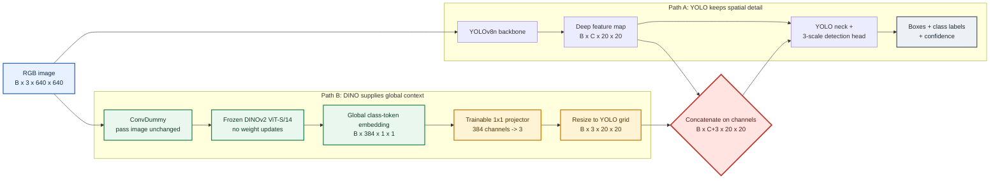

# YOLOv8n + DINOv2: Concepts, Code Walkthrough, and Viva Guide

This guide assumes basic deep-learning knowledge and is designed to help explain both the idea and the implementation in your own words. Read Sections 1-8 to understand the project. Use the talk track and question bank to practise explaining it aloud.

## 1. The Project in One Sentence

I test whether adding DINOv2's **global image context** to the deepest feature of a YOLOv8n detector improves object detection, and compare the fused detector against a YOLOv8n baseline on Pascal VOC using matching training and validation settings.

That is a hypothesis, not a result. The experiment must decide whether it helps.

## 2. Start with the Task: Object Detection

An image-classification model answers: **What is in this image?** For example, "a dog."

An object detector answers three related questions:

- **What?** Which class is each object: dog, person, car, and so on.
- **Where?** What rectangle surrounds each object?
- **How certain?** How confident is the model in each prediction?

A prediction is usually a class label, confidence score, and bounding box. A bounding box can be represented as its centre and size: $(x_c, y_c, w, h)$.

Detection is harder than classification because an image may contain multiple objects at different positions and sizes. A detector needs both semantic information (what patterns mean "dog") and spatial information (where the dog is).

## 3. The Deep-Learning Building Blocks

### 3.1 A neural network and training

A neural network is a sequence of parameterized operations. Its parameters, or **weights**, are adjusted so that predictions better match labelled examples.

For each training example:

1. The model makes predictions in a **forward pass**.
2. A **loss function** measures prediction error against labels.
3. **Backpropagation** computes how each trainable weight contributed to the loss.
4. An **optimizer** updates the weights using those gradients.

Training repeats this process across batches and epochs. An **epoch** is one pass through the selected training images.

### 3.2 Tensors and shapes

A tensor is a multi-dimensional array. Images and feature maps are tensors. In this project, a feature map is generally laid out as:

`(batch, channels, height, width)`

- `batch`: number of images processed together.
- `channels`: different learned feature responses.
- `height`, `width`: the feature map's spatial grid.

A 640 x 640 RGB input has shape `(B, 3, 640, 640)`. At stride 32, a feature map has spatial size 20 x 20. The stride tells us how many input pixels correspond approximately to one feature-map step.

### 3.3 Convolution and learned features

A convolution applies small learned filters across an image or feature map. Early filters often respond to simple patterns such as edges or colour changes. Later layers combine them into more complex patterns and object-related features.

Convolutional layers often downsample by using stride 2. Downsampling reduces spatial size and increases the effective receptive field, so deeper features summarize larger image regions.

A 1 x 1 convolution does not look across neighbouring spatial locations. It mixes information across channels at each location. In this project, DINO produces a 384-channel vector at a 1 x 1 spatial size; a 1 x 1 convolution learns a mapping from those 384 values to 3 output values.

### 3.4 Features, semantics, and location

A **feature** is a learned numerical response that helps a model make a prediction. A feature map retains spatial positions, so the detector can use it to localize objects.

A **global embedding** summarizes an entire image as one vector. It can encode scene-level clues, but by itself it no longer says which location contains an object.

This distinction is central here: YOLO supplies spatial detail; the DINO class-token embedding supplies global context.

## 4. YOLOv8n: The Detection Side

YOLO is a one-stage detector: it predicts object boxes and classes directly from the image in one model pass rather than first proposing regions and then classifying each crop separately.

The project uses **YOLOv8n**, the nano-sized YOLOv8 configuration. The `n` scale is selected to keep the detector relatively small and practical for a student GPU environment. The model still has the usual conceptual stages:

1. **Backbone:** converts pixels into increasingly abstract feature maps.
2. **Neck:** combines information across feature-map resolutions.
3. **Detection head:** predicts classes and boxes at multiple resolutions.

The feature pyramid matters because objects appear at different sizes. High-resolution maps preserve detail useful for small objects; lower-resolution, deeper maps cover larger image regions and encode more abstract semantics. YOLOv8 uses three detection scales in this configuration.

A standard YOLO detection loss contains terms for box localization, class prediction, and distributional box regression (DFL in the current detector). The training code delegates these losses and most training machinery to Ultralytics.

## 5. DINOv2: The Context Side

DINOv2 is a pretrained **vision transformer**. A transformer processes image patches as tokens and uses self-attention to relate information from different parts of an image. Intuitively, self-attention lets a representation at one patch incorporate information from other patches, rather than only looking at a small local neighbourhood.

DINOv2 is trained using self-supervised learning: it learns useful visual representations from images without the object-box labels used by a detector. The released ViT-S/14 backbone used here returns a 384-dimensional global class-token representation for the input image.

The class token is a learned summary token that gathers information across the patch tokens. This implementation uses that **global class-token output**. It does not use the spatial patch-token grid, so DINO contributes scene-level context rather than precise object locations.

### Why keep DINO frozen?

The DINOv2 backbone already contains a large set of pretrained weights. Freezing it means we do not update those weights during this experiment. This:

- avoids spending optimizer updates on the entire transformer;
- reduces training cost and risk of damaging useful pretrained representations on a comparatively small dataset;
- leaves the small projector and YOLO detector trainable.

Frozen does not mean "not used." The DINO encoder still runs in the forward pass and its output affects YOLO after fusion. It just does not receive gradients or weight updates.

## 6. Exactly How the Fusion Works

The RGB input is sent down two paths:

- **YOLO path:** produces spatial feature maps for detecting and localizing objects.
- **DINO path:** produces one 384-dimensional global image embedding.

The projector maps DINO's global embedding from 384 channels to 3 channels. The result starts at 1 x 1 spatial size and is resized to YOLO's deepest grid. For a 640 x 640 image, the grid is 20 x 20, giving context shape `(B, 3, 20, 20)`.

The DINO context is concatenated along the **channel dimension** with the deepest YOLO feature. If the YOLO feature has shape `(B, C, 20, 20)`, after concatenation the shape is `(B, C + 3, 20, 20)`. The grid size stays the same; only the number of channels increases. The downstream YOLO neck and head process this joined tensor and produce detections.

Concatenation does not itself learn which information is useful. The following convolutional/C2f layers learn how to combine the YOLO channels and the added context channels during training.

The global context is broadcast uniformly across all 20 x 20 positions. It tells each location the same image-level summary; it is not a DINO-derived spatial attention map.

## 7. Diagram

How to read it: follow the arrows from the image. The two branches process the same image in different ways. Their features meet at the red fusion node. The detector then produces boxes and classes.

## 8. Code Walkthrough

### 8.1 `ConvDummy`: preserve a route to the raw image

In [scripts/dino_modules.py](scripts/dino_modules.py), `ConvDummy.forward(x)` simply returns `x`. It does not alter pixels or learn parameters. It is a graph-routing helper: the YOLO YAML can refer to this saved raw input later when constructing the DINO branch.

### 8.2 `DINOv2.__init__`: construct the branch

The module loads `dinov2_vits14`, sets the encoder to evaluation mode, and creates `nn.Conv2d(384, 3, kernel_size=1)` as the trainable projector. The projector weight uses a small nonzero initialization; its bias starts at zero.

The input transform resizes the image and uses ImageNet RGB mean/std. Correct preprocessing matters because pretrained weights expect input values in a particular range and distribution.

### 8.3 `DINOv2.forward`: produce the context map

Conceptually the forward method performs:

1. Preprocess the RGB image.
2. Run DINO under `torch.no_grad()` and get the 384-value global embedding.
3. Add two singleton spatial dimensions, changing `(B, 384)` into `(B, 384, 1, 1)`.
4. Apply the learned 1 x 1 projector to produce `(B, 3, 1, 1)`.
5. Bilinearly resize to `(H/32, W/32)`.

The DINO encoder is inside `no_grad`; the projector is outside that block, so its weights can receive gradients and be trained.

### 8.4 `register_modules()`: teach Ultralytics the module names

Ultralytics reads YAML names such as `Conv` and `C2f` from its module registry. The custom Python classes are not built in, so `register_modules()` adds `ConvDummy` and `DINOv2` to the namespace the YAML parser uses. Without this, model construction fails with an unknown module name.

### 8.5 `configs/yolov8-dino.yaml`: describe the graph

The YAML specifies connections using layer indices. It adds a raw-image bypass and DINO layer to the backbone and sends both DINO output and YOLO's SPPF feature to a `Concat` node. The head then continues through the usual upsample, concat, C2f, and Detect stages.

### 8.6 Transfer compatible YOLO weights

In the notebook's `build_fused_model()` (and in [scripts/train.py](scripts/train.py)), two added graph layers shift the indices compared with stock YOLOv8n. The code maps new indices to old indices, then copies a weight tensor only if its shape matches.

Two C2f convolutions now accept three extra channels. Their old YOLO filters cannot be loaded directly because the input dimensions differ. The code creates a wider tensor, copies the original filters around the inserted context channels, and initializes only the new channels with small nonzero values. This preserves pretrained YOLO features wherever possible.

### 8.7 Freeze DINO, but train the detector and projector

At training start, a callback calls `requires_grad_(False)` on the DINO encoder and sets it to evaluation mode. YOLO and the projector remain trainable. Another callback prints the projector's weight and bias norms at epoch end. This makes it observable whether the adapter changes during full training.

### 8.8 Why use a nonzero projector initialization?

The first COCO8 fusion run used a zero projector. Its saved projector remained zero and its detections collapsed. The current code gives the projector a small nonzero starting point and initializes the new YOLO context filters nonzero as well. This is a reasoned correction, not proof that training will succeed; we evaluate the actual VOC run.

## 9. Training and Evaluation: What the Notebook Does

The portable notebook is [YOLOv8_DINOv2_VOC_Kaggle_Colab.ipynb](YOLOv8_DINOv2_VOC_Kaggle_Colab.ipynb).

1. Detects whether it is running in Kaggle or Colab, fixes random seeds, and checks for a GPU.
2. Installs a pinned Ultralytics version and creates the fusion module/config inside the runtime.
3. Builds the fused model, copies compatible YOLOv8n weights, and registers the custom modules.
4. Runs a **one-batch synthetic gradient check**. This verifies tensor shapes, finite predictions, a nonzero projector gradient, and a projector parameter update. It is not VOC training and is not included in the submitted metrics.
5. Trains standard YOLOv8n on VOC.
6. Trains the fused YOLOv8n + DINOv2 model on the same VOC settings.
7. Evaluates both at the same resolution and writes metrics, plots, checkpoints, and a side-by-side prediction under `ARTIFACT_DIR`.

The separate short VOC smoke-training run was removed. The notebook now proceeds from the gradient check directly to the full baseline/fusion comparison.

The supplied Ultralytics VOC configuration uses 16,551 training images and 4,952 VOC2007 test images as the comparison validation/holdout set, with 20 classes. The current settings are 640-pixel images, batch size 2, 10 epochs, AdamW, learning rate 0.001, FP32, and seed 42. Both models receive the same settings. The holdout should not be used repeatedly for tuning and then described as an untouched final test set.

## 10. Metrics: How to Explain the Numbers

- **Precision:** of the boxes predicted as objects/classes, what fraction are correct? Higher precision generally means fewer false positives.
- **Recall:** of the labelled objects, what fraction did the detector find? Higher recall generally means fewer missed objects.
- **IoU:** intersection-over-union measures overlap between a predicted box and a ground-truth box. It ranges from 0 (no overlap) to 1 (perfect overlap).
- **mAP50:** mean average precision at IoU 0.50. A predicted box can count as a match at a relatively permissive overlap threshold.
- **mAP50-95:** average mAP across IoU thresholds 0.50, 0.55, ..., 0.95. This is stricter because it rewards more accurately aligned boxes.
- **Inference time:** measured time per image for prediction. It helps expose the compute cost of adding DINO, though startup/download time should not be mixed with steady-state inference time.

Use the same validation data, resolution, and metric implementation for both models. A higher mAP for one small or fixed split is evidence for this experiment, not universal proof.

## 11. Challenges and Honest Status

### VOC experiment results

Two fusion variants were trained on Pascal VOC on a Kaggle GPU:

| Model | Precision | Recall | mAP50 | mAP50-95 | Inference ms/img |
|---|---:|---:|---:|---:|---:|
| YOLOv8n baseline | 0.6768 | 0.6427 | 0.6852 | 0.4768 | 2.68 |
| YOLOv8n + DINOv2 v1 (global token, 3ch) | 0.4617 | 0.3911 | 0.3691 | 0.2182 | 36.88 |
| **YOLOv8n + DINOv2 v2 (patch tokens, 64ch, gated)** | **0.7810** | **0.7505** | **0.8213** | **0.5522** | 34.77 |

V1 (global token, 3ch) **failed** — it was worse than baseline on all metrics because the global token has no spatial detail. V2 (spatial patch tokens, 64ch, gated) **succeeded** — it improved mAP50 by +13.6% and mAP50-95 by +7.5% over baseline. The key difference: V2 uses location-specific patch tokens instead of a uniform broadcast, and a gated fusion that starts near zero so the pretrained detector is not disrupted.

### Earlier COCO8 failure (for provenance only)

The earlier COCO8 fused run used a zero-initialized DINO projector and scored zero. That was a separate failed experiment with different code. Its numbers must not be confused with the VOC result above.

## 12. Ready-to-Say Presentation

> My project tests whether global visual context from DINOv2 can help the YOLOv8n object detector. Object detection means predicting what objects are present and where they are, using class labels and bounding boxes. YOLO provides spatial features and detects at three scales. DINOv2 is a pretrained vision transformer that summarizes the input image in a 384-dimensional global embedding.
>
> I send the same RGB image through two paths. The first is the normal YOLOv8n detector. The second preserves the original image with a pass-through module and sends it through frozen DINOv2. A trainable 1 x 1 projector converts DINO's embedding to three channels and resizes it to the deepest YOLO feature grid. I concatenate those channels with YOLO's deep spatial feature before the neck and detection head. YOLO still handles object localization; DINO supplies image-level context.
>
> To keep the detector pretrained, I transfer matching YOLOv8n weights into the modified graph. Two convolution inputs are wider by three channels, so I copy the old weights into their corresponding positions and initialize only the new context weights. DINO's encoder is frozen; the projector and YOLO detector are trainable. I check the fusion shapes and verify that detection loss can update the projector.
>
> I compared baseline YOLOv8n and two fusion variants using the same Pascal VOC split and training settings. V1 used a global token and scored worse than baseline. V2 uses spatial patch tokens with a 64-channel gated projection and **beat the baseline on all metrics**: mAP50 went from 0.685 to 0.821 (+13.6%), and mAP50-95 from 0.477 to 0.552 (+7.5%). The spatial patch tokens give the detector location-specific DINO features that the global token cannot.

## 13. Questions You May Be Asked

### "What is the novel part of your implementation?"

The implementation tests two fusion strategies: (1) V1 fuses DINOv2's global class token as broadcast context, and (2) V2 fuses DINOv2's spatial patch tokens with a 64-channel gated projection. V2's gated spatial fusion improved over the YOLOv8n baseline on Pascal VOC. I patched Ultralytics' `parse_model` to correctly track custom module output channels, which was necessary for the 64-channel projection.

### "Why not just use DINOv2 for detection?"

The chosen design keeps YOLO as the detector because it already provides an efficient multi-scale box/class head. DINOv2 is used as a complementary feature source. This project specifically tests whether that combination is useful.

### "Why does YOLO need spatial features if DINO understands the image?"

This implementation uses DINO's global class token, which summarizes the image but does not identify object coordinates. YOLO's spatial feature maps are retained to locate and classify individual objects.

### "Does the context map contain object masks or attention heatmaps?"

V1 used a 3-channel broadcast of the global token (no spatial detail). V2 uses 64-channel spatial patch tokens — a 384-dimensional feature at each patch position, reshaped to a 2D grid and projected to 64 channels. The patch tokens encode location-specific context but are not segmentation masks or attention heatmaps.

### "What does freezing mean? Is DINO removed from training?"

No. DINO still runs during the forward pass and supplies the embedding. Freezing only means its encoder parameters are not updated by backpropagation. The projector after it remains trainable.

### "What is a gradient?"

A gradient is a numerical signal describing how changing a parameter would change the loss. If the projector has a nonzero gradient and an optimizer step changes its weights, there is a learning path from the detector loss to the projector. That check proves connectivity, not that the model will generalize or improve validation accuracy.

### "Why transfer pretrained weights?"

Training all YOLO weights from random initialization would discard useful learned features and need much more data. Transferring compatible weights starts the modified model close to a functioning detector. New fusion-related weights must still be initialized because they have no direct counterpart in the original network.

### "Why are some pretrained weights not copied?"

A tensor can only be copied directly when its dimensions and semantics match. Expanded C2f inputs need special padding for the three extra context channels. The transfer code skips incompatible shapes; class-output layers can also differ because the pretrained checkpoint has COCO classes while VOC has 20 classes.

### "How can you tell whether DINO helped?"

Compare the fused model with a baseline trained and validated using the same dataset split, resolution, epochs, optimizer, seed, and metric code. Look at the reported metrics and latency. Confirm the projector changed during training. A nonzero gradient alone is not an improvement result.

### "Why Pascal VOC?"

It is a public, annotated object-detection dataset with 20 classes and thousands of images, much larger than COCO8 and practical for a Kaggle GPU. The exact split comes from the Ultralytics VOC configuration and is documented in the notebook.

### "Is VOC test being used as test or validation?"

The supplied Ultralytics config lists VOC2007 test images as `val`, so in this notebook they serve as the comparison holdout. I should call them the validation/holdout split and not claim a separate untouched test evaluation.

### "What are your results?"

I tested two fusion variants on Pascal VOC. V1 (global token, 3ch) scored precision 0.4617, recall 0.3911, mAP50 0.3691, mAP50-95 0.2182 — worse than the baseline (mAP50 0.6852). V2 (spatial patch tokens, 64ch, gated) scored precision 0.7810, recall 0.7505, mAP50 0.8213, mAP50-95 0.5522 — **better than baseline on all metrics**. V2 improved mAP50 by +13.6% and mAP50-95 by +7.5%. The key was using spatial patch tokens (location-specific) instead of a global token (uniform), and a gated fusion that doesn't disrupt the pretrained detector initially. Inference is ~13x slower due to DINOv2's ViT forward pass.

### "What are the main limitations?"

V2's spatial patch-token fusion improved over baseline, but the result is from one seed and one fixed VOC holdout split. Inference latency increased ~13x due to DINOv2's ViT forward pass. A larger study would use multiple seeds, more independent test data, and explore lighter DINO variants for latency reduction.

## 14. Five-Minute Preparation Checklist

- Explain the difference between classification and detection.
- Memorize the data path: RGB -> YOLO spatial features; RGB -> frozen DINO -> global embedding -> trainable projection -> resize -> concatenate -> YOLO detector.
- Remember the important shapes at 640: input `(B,3,640,640)`, DINO vector `(B,384)`, context `(B,3,20,20)`, fused deep feature `(B,C+3,20,20)`.
- Know exactly what is frozen (DINO encoder) and trainable (projector and YOLO detector).
- Explain why pretrained weights need index remapping and why C2f inputs need 64 added channels (V2) or 3 (V1).
- Explain precision, recall, IoU, mAP50, and mAP50-95 in one sentence each.
- State the COCO8 failure honestly and do not present it as a DINO improvement.
- State the VOC V1 result honestly: global token fusion performed worse than baseline (no spatial detail).
- State the VOC V2 result: spatial patch-token gated fusion **improved over baseline** — mAP50 0.685→0.821 (+13.6%), mAP50-95 0.477→0.552 (+7.5%).
- Explain why V2 works: patch tokens carry location-specific features; gated fusion starts near zero so pretrained detector is not disrupted.
- Check Kaggle's final run status and actual comparison file before quoting VOC metrics.

## 15. Source Files

- [Portable Kaggle/Colab notebook (V1)](YOLOv8_DINOv2_VOC_Kaggle_Colab.ipynb)
- [V2 fusion notebook](YOLOv8_DINOv2_VOC_v2_Fusion.ipynb)
- [V1 fusion module (global token)](scripts/dino_modules.py)
- [V2 fusion module (patch tokens, gated)](scripts/dino_modules_v2.py)
- [V1 fusion model YAML](configs/yolov8-dino.yaml)
- [V2 fusion model YAML](configs/yolov8-dino-v2.yaml)
- [Training entry point](scripts/train.py)
- [Experiment history and improvement plan](EXPERIMENT_RESULTS_AND_IMPROVEMENT_PLAN.md)
- [Concise implementation/presentation notes](IMPLEMENTATION_EXPLANATION_FOR_PRESENTATION.md)
